<p align="center">
  
</p>

# look-what-i-can-do 🤸

**Your README, as an animated hero. One command.**

It reads your README's title, tagline, run command and example output, types the command, plays the output, and writes an animated SVG you commit and show at the top: a few KB, full color, sharp at any size. `--gif` exports the same hero as a GIF for places that don't take SVG, like X, LinkedIn and Product Hunt. The image above is this README, served live from GitHub by the [hosted URL](#hosted-url-lookwhaticandodev) with nothing committed. The command below makes the same image locally.

<!-- look-what-i-can-do highlight="rendered" -->
```console hero
$ node lwicd.mjs -o docs/hero.svg
🤸 look what I can do!

  read      README.md: look-what-i-can-do 🤸
  block     the one marked hero
  replayed  12 lines of example output, as written (READMEs have no colors; --live runs it)
  rendered  docs/hero.svg · 1280×640 · 8.5 s loop · 7.6 KB · in 0.0 s

Commit docs/hero.svg, then paste at the top of your README:

<p align="center">
  
</p>
```

## Run it

```sh
npx look-what-i-can-do                     # in your repo: an animated SVG of your README's hero (needs only Node)
npx look-what-i-can-do --live              # run the command in a terminal: real output, real colors
npx look-what-i-can-do capture             # fill the ```console hero block with its command's real output
npx -p look-what-i-can-do -p playwright-core lwicd --gif   # GIF export (also needs Chrome or Chromium, and ffmpeg)
```

It uses the README GitHub would show: `.github/`, then the root, then `docs/`. Pass a file or a folder to use another. Inside this repo, `node lwicd.mjs serve` runs the hosted URL locally and `npm test` runs the tests.

| Option | What it does |
|---|---|
| `-o, --out <file>` | Where to write it (default `look-what-i-can-do.svg`, or `.gif` with `--gif`) |
| `--gif` | Export a GIF of the same hero instead |
| `--live` | Run the command in a pseudo-terminal and show its real output and colors |
| `--command <cmd>` | The command to show, and with `--live` to run (default: the README's) |
| `--highlight <text>` | Sweep a highlight over the first output line that contains this text |

## Tell it what to animate

Add `hero` after the language on the fence of the block you want: ```` ```console hero ````. GitHub ignores words after the language, so nobody sees the marker, and the marked block always wins. A console block holds `$ command` and its output. A marked block without a `$` line is the output alone, and the command comes from your shell blocks. Options go in an HTML comment, which GitHub doesn't show either:

```html
<!-- look-what-i-can-do highlight="unbacked" -->
```

To fill the block, `capture` runs its `$` command in a real terminal and writes what it printed into the block, colors dropped. That way the example is always a real run. If the command fails, the README stays as it was.

Without a marker it guesses: the first `console` block with a `$ command` and output, else the first run command (`npx`, `npm`, `pip`, `brew`, `cargo`, `go`, `docker`, `node`, `python`, …) in a shell block with the first untagged or `text` block as its output. The CLI tells you which one it used. The title is the first `#` heading. The tagline is the first paragraph after it that isn't HTML, a badge or a table, cut to its first sentence past 100 characters.

## Let an agent do it

[`skills/look-what-i-can-do`](skills/look-what-i-can-do/SKILL.md) is a skill for Claude Code and other agents that read skills. Ask for a README hero and the agent does the rest:

1. Picks the command and the headline line.
2. Marks the block.
3. Fills it with `capture`, never typing output itself.
4. Shows you the real output before anything is committed.
5. Renders the hero and hands back the embed.

To install it for yourself, link it:

```sh
ln -s "$PWD/skills/look-what-i-can-do" ~/.claude/skills/look-what-i-can-do
```

## Hosted URL: lookwhaticando.dev

For a public repo, paste this at the top of its README with your owner and repo filled in. Nothing to install, nothing to commit:

```html
<p align="center">/<repo>.svg" width="800" alt="<repo>"></p>
```

`serve.mjs` serves `/<owner>/<repo>.svg` for any public repo: the README GitHub shows on the repo page, replayed as written. `?path=` picks another README (monorepos), `?ref=` a branch or tag, `?highlight=` a line. It runs as a Cloudflare Worker (`wrangler.jsonc`). `npx wrangler dev` runs it locally in the Workers runtime, and `node lwicd.mjs serve` runs it in plain Node.

- **Fresh:** every response is `Cache-Control: no-cache` with an ETag. GitHub's image proxy holds each image for about a minute (measured), GitHub is asked at most once a minute per repo, and GitHub's raw files cache for 5 minutes. So README edits show up within about 7 minutes.
- **Finds the right README:** one API call per repo per day. If that's rate-limited, it checks `.github/`, the root, then `docs/`, in GitHub's order.
- **Private repos are never served:** README bytes only come from unauthenticated raw fetches, and image URLs are public.
- **Errors are images, not broken icons:** a `200` with an SVG that says what's wrong and how to fix it, plus an `X-LWICD-Error` header.

## Why SVG

The same agent-nocap hero is 7.9 KB as SVG and about 950 KB as GIF. SVG keeps full color where GIF has 256, stays sharp on every screen, and barely touches your Git history when you re-render it. GitHub shows animated SVG through ``, and it loops on its own. Viewers who turn on reduced motion get the finished frame.

## No cap

The image never shows output your tool can't produce.

- **Replay** (the default) shows your README's example output exactly as written. README code blocks carry no colors, so none are added. It runs nothing from your repo.
- **Live** runs the command in a pseudo-terminal, so tools that only color a real terminal keep their colors. It refuses to render when the command fails. It runs in your README's folder; when `npx`, `bunx`, `pnpm dlx` or `yarn dlx` can't find the command there (exit 127, common inside a package's own repo), it tries once more from outside the repo. Live output is your real output: review it before you publish.
- Too tall for the frame: whole blocks from the top plus the last block (footers, links) stay, and the cut is marked `⋮`. Too wide: the font shrinks, then the line is cut and marked `…`.
- The accent color touches the prompt and the highlight, never your output.

[examples/agent-nocap.svg](examples/agent-nocap.svg) is a replay of [agent-nocap](https://github.com/SuperLogicAI/agent-nocap)'s README.

## Known limits

The SVG uses the viewer's monospace font, so line widths differ slightly between systems. Terminal background colors, like badge-style labels, are dropped rather than faked. `--gif` needs headless Chromium (playwright-core's, or Google Chrome) and ffmpeg; a pure-JS export is planned. `--live` needs `script` (macOS, Linux) and handles colors, carriage returns and one-line spinners, not full-screen or multi-line progress displays. A README without example output replays the command alone: add an example, or use `--live`. Tested in Chromium so far; Safari, Firefox and GitHub's mobile app are next.

Built by [Super Logic AI](https://superlogicai.com).
